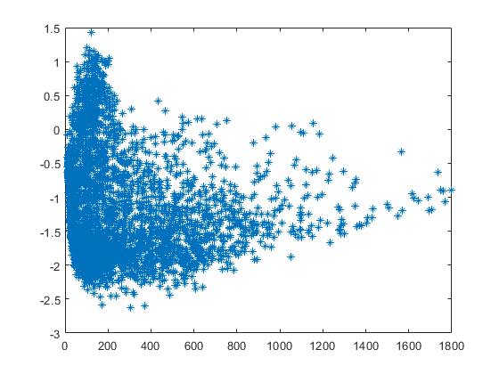
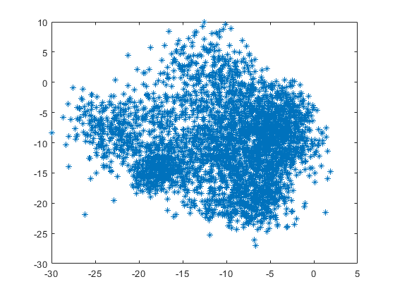

PAV - P4: reconocimiento y verificación del locutor
===================================================

Obtenga su copia del repositorio de la práctica accediendo a [Práctica 4](https://github.com/albino-pav/P4)
y pulsando sobre el botón `Fork` situado en la esquina superior derecha. A continuación, siga las
instrucciones de la [Práctica 2](https://github.com/albino-pav/P2) para crear una rama con el apellido de
los integrantes del grupo de prácticas, dar de alta al resto de integrantes como colaboradores del proyecto
y crear la copias locales del repositorio.

También debe descomprimir, en el directorio `PAV/P4`, el fichero [db_8mu.tgz](https://atenea.upc.edu/pluginfile.php/3145524/mod_assign/introattachment/0/spk_8mu.tgz?forcedownload=1)
con la base de datos oral que se utilizará en la parte experimental de la práctica.

Como entrega deberá realizar un *pull request* con el contenido de su copia del repositorio. Recuerde
que los ficheros entregados deberán estar en condiciones de ser ejecutados con sólo ejecutar:

~~~~~~~~~~~~~~~~~~~~~~~~~~~~~~~~~~~~~~~~~~~~~~~~~~~~~.sh
  make release
  run_spkid mfcc train test classerr verify verifyerr
~~~~~~~~~~~~~~~~~~~~~~~~~~~~~~~~~~~~~~~~~~~~~~~~~~~~~

Recuerde que, además de los trabajos indicados en esta parte básica, también deberá realizar un proyecto
de ampliación, del cual deberá subir una memoria explicativa a Atenea y los ficheros correspondientes al
repositorio de la práctica.

A modo de memoria de la parte básica, complete, en este mismo documento y usando el formato *markdown*, los
ejercicios indicados.

## Ejercicios.

### SPTK, Sox y los scripts de extracción de características.

- Analice el script `wav2lp.sh` y explique la misión de los distintos comandos, y sus opciones, involucrados
  en el *pipeline* principal (`sox`, `$X2X`, `$FRAME`, `$WINDOW` y `$LPC`).
  
  sox: este comando se utiliza para poder transformar el fichero de entrada en fformato wav a un fichero raw.
  
  $X2X: se refiere al comando x2x del SPTK que sirve para hacer conversiones entre distintos formatos de datos.
  
  $FRAME: es el comando sptk frame que lo que hace es dividir la señal en tramas en el caso de `wav2lp.sh` dividimos la señal en 240 muestras con desplazamiento de ventana de 80 muestras.
  
  $WINDOW: este comando se utiliza para enventanar una señal con la opción de elegir diferentestipos de ventanas. En el script `wav2lp.sh` lo utilizamos de la siguiente manera: 
  
                          $WINDOW -l 240 -L 240
  que nos indica el numero de muestras de la trama de entrada (precedido por -l) y el numero de muestras de la trama de la salida (precedido por -L) que en este caso tienen la misma longitud. Como no se indica el tipo de ventana, por defecto se utiliza la ventana de Blackman.
  
  $LPC: se refiere al comando sptk lpc que calcula los coeficientes de predicción lineal
  
                                
- Explique el procedimiento seguido para obtener un fichero de formato *fmatrix* a partir de los ficheros
  de salida de SPTK (líneas 41 a 47 del script `wav2lp.sh`).
  
  Para obtener el fichero en formato *fmatrix* obtenemos el numero de columnas que corresponde con el numero de coeficientes cepstrales más uno ya que el primer elemento se corresponde con la ganancia de predicción. Además obtenemos el numero de filas transformando la señal parametrizada a texto utilizando `sox +fa`. De este mode construimos el fichero fmatrix poniendo el numero de filas y columnas, seguidos de los datos de la señal parametrizada.
  
  
  * ¿Por qué es conveniente usar este formato (u otro parecido)?
  
  Para poder obtener para cada trama los coeficientes cepstrales. De este modo tenemos de un modo compacto cada trama con sus  coeficientes correspondientes.
  

- Escriba el *pipeline* principal usado para calcular los coeficientes cepstrales de predicción lineal
  (LPCC) en su fichero <code>scripts/wav2lpcc.sh</code>:
  
sox $inputfile -t raw -e signed -b 16 - | $X2X +sf | $FRAME -l 240 -p 80 | $WINDOW -l 240 -L 240 |
	$LPC -l 240 -m $lpc_order | $LPCC -m $lpc_order -M $cep_order > $base.lpcc
  
- Escriba el *pipeline* principal usado para calcular los coeficientes cepstrales en escala Mel (MFCC) en
  su fichero <code>scripts/wav2mfcc.sh</code>:
  
  sox $inputfile -t raw -e signed -b 16 - | $X2X +sf | $FRAME -l 240 -p 80 | $WINDOW -l 240 -L 240 |
	$MFCC -l 240 -m $mfcc_order -s 8 -E> $base.mfcc
  

### Extracción de características.

- Inserte una imagen mostrando la dependencia entre los coeficientes 2 y 3 de las tres parametrizaciones
  para una señal de prueba.
  
  lpc:
  
  
			
  lpcc:
  
  

  mfcc:
  
  
			 
  
  + ¿Cuál de ellas le parece que contiene más información?
  
Contiene más información los coeficientes mfcc ya que sus coeficientas estan más incorrelados que en el resto.

- Usando el programa <code>pearson</code>, obtenga los coeficientes de correlación normalizada entre los
  parámetros 2 y 3, y rellene la tabla siguiente con los valores obtenidos.

  |                        | LP   | LPCC | MFCC |
  |------------------------|:----:|:----:|:----:|
  | &rho;x[2,3] |  -0.874552    |  0.147184   | -0.216865     |
  
  + Compare los resultados de <code>pearson</code> con los obtenidos gráficamente.
  
  Bueno podemos ver que los coeficiente 2 y 3 del lp estan más correlados que en los otros casos tal y como podemos comprobar en la gráfica. A diferencia de como hemos dicho a priori los mfcc en este caso parece estar ligeramente más correlado que el lpcc.
  
- Según la teoría, ¿qué parámetros considera adecuados para el cálculo de los coeficientes LPCC y MFCC?

Para los LPCC se suele utilizar Nlpc=12 y para los MFCC Nmfcc=13.

### Entrenamiento y visualización de los GMM.

Complete el código necesario para entrenar modelos GMM.

- Inserte una gráfica que muestre la función de densidad de probabilidad modelada por el GMM de un locutor
  para sus dos primeros coeficientes de MFCC.
  
  
  
- Inserte una gráfica que permita comparar los modelos y poblaciones de dos locutores distintos (la gŕafica
  de la página 20 del enunciado puede servirle de referencia del resultado deseado). Analice la capacidad
  del modelado GMM para diferenciar las señales de uno y otro.
  GMM: SES000 LOC: SES000
  
    
  GMM: SES000 LOC: SES013
  
      
  GMM: SES013 LOC: SES000
  

  GMM: SES013 LOC: SES013
  

### Reconocimiento del locutor.

Complete el código necesario para realizar reconociminto del locutor y optimice sus parámetros.

- Inserte una tabla con la tasa de error obtenida en el reconocimiento de los locutores de la base de datos
  SPEECON usando su mejor sistema de reconocimiento para los parámetros LP, LPCC y MFCC.

 | Parámetro | nerr  | error_rate |
 | --------- | ----- | -----------|
 | LP        | 272   | 34.65 %    |
 | LPCC      | 117   | 14.90 %    |
 | MFCC      | 34    | 4.46 %     |
 
### Verificación del locutor.

Complete el código necesario para realizar verificación del locutor y optimice sus parámetros.

- Inserte una tabla con el *score* obtenido con su mejor sistema de verificación del locutor en la tarea
  de verificación de SPEECON. La tabla debe incluir el umbral óptimo, el número de falsas alarmas y de
  pérdidas, y el score obtenido usando la parametrización que mejor resultado le hubiera dado en la tarea
  de reconocimiento.
 
### Test final y trabajo de ampliación.

- Recuerde adjuntar los ficheros `class_test.log` y `verif_test.log` correspondientes a la evaluación
  *ciega* final.

- Recuerde, también, enviar a Atenea un fichero en formato zip o tgz con la memoria con el trabajo
  realizado como ampliación, así como los ficheros `class_ampl.log` y/o `verif_ampl.log`, obtenidos como
  resultado del mismo.
